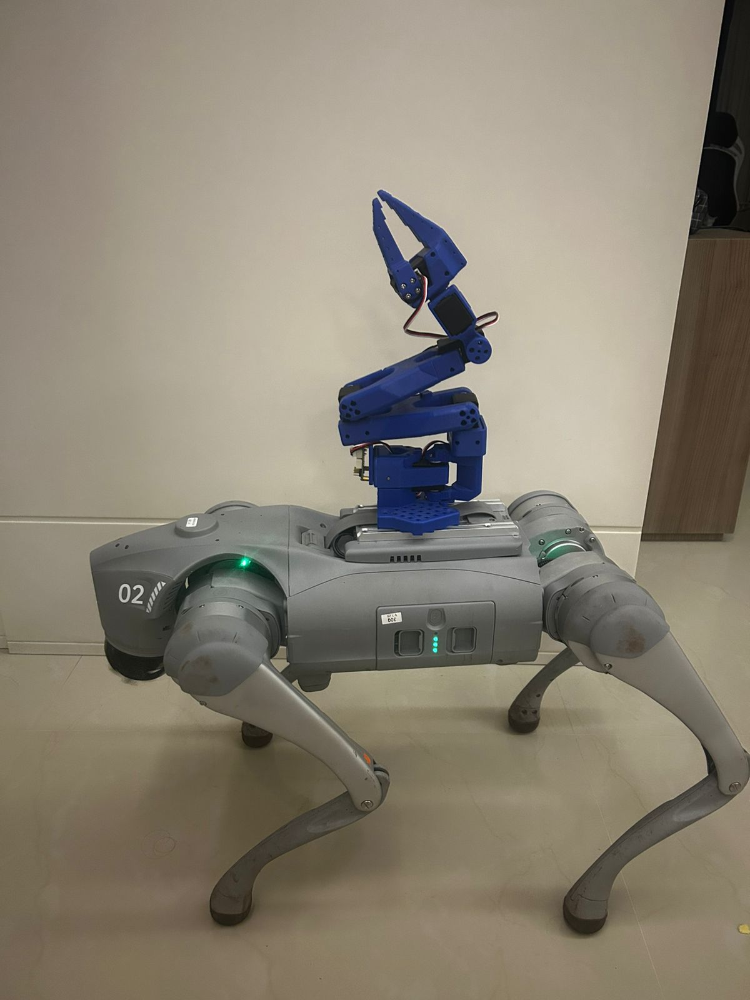

# 🐕 Autonomous Industrial Inspection with Unitree Go2 & Edge AI


An end-to-end autonomous inspection pipeline deployed on a **Unitree Go2 Edu** quadruped robot for real-time Personal Protective Equipment (PPE) detection in heavy industrial mining environments.

This repository demonstrates the integration of **Edge AI (YOLOv8)**, **3D SLAM (FAST-LIO)**, and **ROS 2 Navigation**, effectively bridging complex algorithmic theories with real-world hardware deployments.

---

## 📸 System Showcase: Proof-of-Concept Targeted Mapping

To demonstrate full technical capability within an optimized development cycle, this project maps and inspects a high-fidelity **"Critical Infrastructure Zone"** (e.g., a critical machinery cluster corridor). This proof-of-concept proves that the entire pipeline can be rapidly tested, validated, and deployed on the edge before scaling to larger environments.

### 1. High-Fidelity Targeted Mapping & Environment Context


*The video shows the Unitree Go2 navigating a complex industrial corridor with specific machinery (e.g., control cabinets, machinery with pipes). This targeted mapping approach allows for generating the necessary environmental context for a targeted inspection route.*

### 2. Resulting 3D Plant Mapping (Hesai XT-16 LiDAR)
*Mapping generated via FAST-LIO execution on the base station from Edge ROSbag data.*


*The resulting dense point cloud of the specified machinery zone, processed using pointcloud and IMU data.*

---

## 🚀 Edge Deployment Architecture

### Locomotion & Edge Hardware Deployment


The system relies on a decentralized communication architecture using **CycloneDDS**. This configuration, implemented via a custom XML file, routes all ROS 2 traffic through the `wlan0` interface. This allows the robot's Nvidia Orin board (running ROS 2 Foxy) to communicate peer-to-peer over local Wi-Fi with a high-performance off-board base station (Dell Alienware running ROS 2 Jazzy), without mobile internet constraints.

---

## 🧠 Machine Learning & Computer Vision

The core mission is active PPE monitoring. The vision system processes frames from the RealSense camera to detect workers missing mandatory safety equipment.

### Data Extraction Pipeline (MLOps)

I developed a custom Python data engineering pipeline that reads ROS 1 `.bag` and ROS 2 `.mcap` files directly, eliminating system conflicts and streamlining data volume for YOLOv8 training.

```python
# snippet from scripts/extract_dataset.py
def extract_images():
    with Reader(bag_file) as reader:
        for connection, timestamp, rawdata in reader.messages():
            if connection.topic == camera_topic:
                # Downsampling logic: Extracts 1 out of every 15 frames for clean YOLO training
                if frame_id % 15 == 0:
                    msg = reader.deserialize(rawdata, connection.msgtype)
                    img = np.ndarray(shape=(msg.height, msg.width, 3), dtype=np.uint8, buffer=msg.data)
                    img = cv2.cvtColor(img, cv2.COLOR_RGB2BGR)
                    cv2.imwrite(os.path.join(output_folder, f"frame_{saved_count:04d}.jpg"), img)
                    saved_count += 1
                frame_id += 1
```

*This snippet proves competence in manipulating low-level robotic messaging formats to solve data scarcity in specialized industrial domains.*

---

## 🗺️ 3D Mapping & SLAM

To construct the high-fidelity 3D map for navigation, I implemented a hybrid SLAM architecture using the **Hesai XT-16 LiDAR**. To avoid computation bottlenecks on the embedded Orin board (Segmentation Faults), a distributed method was adopted:

1.  **Edge Recording:** Raw point cloud and IMU data topics recorded directly to the robot's SSD via ROS 2 Foxy during the targeted walk.
2.  **Off-Board SLAM Engine:** Raw `.bag` files are replayed on the Alienware host (running ROS 1 Noetic via Docker), feeding the Point-LIO / FAST-LIO mapping algorithm.

---

## 🦾 Future Work: Mobile Manipulation

The next phase involves integrating a **101 Lee Robotic Arm** onto the Go2 platform. This will transform the passive inspector into an active manipulator capable of interacting with the environment (e.g., opening industrial doors, pressing buttons).



*Current integration focuses on calculating inverse kinematics and integrating Behavior Trees for seamless arm-body coordination.*

---

## 📁 Repository Structure

```text
Unitree_Autonomous_Inspection/
├── data/
│   ├── raw/            # Immutable original data (images, videos)
│   ├── processed/      # Transformed data (augmented, resized)
│   └── annotations/    # Labels/ground truth (JSON, XML, YOLO txt)
├── docs/               # System architecture diagrams, 3D map results, and media (GIFs)
├── robotics/           # ROS 2 nodes, CycloneDDS configs, and Rosbag extraction scripts
├── src/
│   ├── data_loader.py  # Data loading and preprocessing
│   ├── train.py        # Training pipeline
│   ├── model.py        # Model architecture
│   └── utils.py        # Auxiliary functions
├── notebooks/          # Jupyter notebooks for experimentation
├── config/             # Configuration files (YAML, JSON, params, CycloneDDS XML)
├── models/             # Saved trained models (pth, h5, YOLOv8 .pt weights)
├── results/            # Visualizations, logs, evaluation metrics
├── tests/              # Unit tests
├── README.md           # Project documentation
├── requirements.txt    # Project dependencies
└── .gitignore          # Ignored files and folders
```

---
*Author: Jorge Metri Miranda*